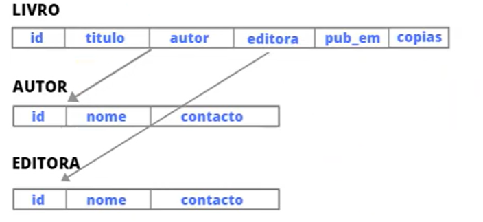

## Banco de dados 

- Coleção de itens de dados relacionados.  
- Dados significam fatos conhecidos que podem ser registrados e que tem significado implicito.  

### Tópicos 

- Fases do design do banco de dados.  
- Atributos e Entidades.  
- Mapeamento.  
- Modelo de dados Relacional.  
- Operações SQL.  
- As restrições relacionais.  

## O que são dados?

- Fatos relacionados a qualquer objeto em consideração.  
    __Exemplo:__ seu nome, idade, altura, peso, etc.

## O que é SQL? 

- Linguagem padrão para lidar com bancos relacionais.  
    __Exemplo:__ MySQL, Oracle, MS SQL Server, Sybase, etc. 

- Um objeto tem fatos como nome, idade, país, altura e etc.

## Fases do design do banco de dados

Com o desenvolvimento de um banco de dados, encontramos diferentes fases, sendo elas:

    1. Coleta de requisitos 
    2. Análise de requisitos 
    3. Design
    4. Implementação 

* Uma fase depende da outra 

### 1. Coleta de requisitos 

- Exemplo: Estamos construindo um banco de dados para uma livraria, nesse caso o desenvolvedor terá que entrevistar as entidades daquela livraria para coletar os requisitos necessários para a criação do banco de dados.

### 2. Análise de requisitos 

- 1 - Requisitos de banco de dados (back-end) (Oracle, MySql, etc)
- 2 - Requisito funcional (front-end) (Web, Mobile, Desktop)

### 3. Design

- Design esquema conceitual (para requisitos do banco de dados)
- Esquema da lógica (mapeamento)
- Projeto físico (esquema interno)
- Análise funcional 

### 4. Implementação

- O programador do aplicativo grava o código real para implementar o pacote de banco de dados da livraria.

- Uso do SQL entra nessa etapa.    

### Design esquema conceitual (para requisitos do banco de dados)

<table border="1">
    <thead>
        <tr>
            <th>LIVRO</th>
            <th></th>
            <th></th>
            <th></th>
            <th></th>
            <th></th>
            <th></th>
        </tr>
    </thead>
    <tbody>
        <tr>
            <th><b></b></th>
            <th>id</th>
            <th>titulo</th>
            <th>autor</th>
            <th>editora</th>
            <th>pub_em</th>
            <th>copias</th>
        </tr>
    </tbody>
</table> 
<table border="1">
    <thead>
        <tr>
            <th>AUTOR</th>
            <th></th>
            <th></th>
            <th></th>
        </tr>
    </thead>
    <tbody>
        <tr>
            <th><b></b></th>
            <th>id</th>
            <th>nome</th>
            <th>contato</th>
        </tr>
    </tbody>
</table> 
<table border="1">
    <thead>
        <tr>
            <th>EDITORA</th>
            <th></th>
            <th></th>
            <th></th>
        </tr>
    </thead>
    <tbody>
        <tr>
            <th><b></b></th>
            <th>id</th>
            <th>nome</th>
            <th>contato</th>
        </tr>
    </tbody>
</table> 

### Esquema da lógica (mapeamento)

### Análise funcional

  

## Entidade

1.  Entidade é definida como um objeto com existência física.
2. Cada entidade consiste em um conjunto de atributos. 
- No nosso exemplo da livraria, as entidades são: Livro, Editora, Autor.

## Atributo 

- As propriedade de uma entidade são chamadas de atributo, com a ajuda de atributo podemos distinguir uma entidade de outra entidade.

- Essa pessoa é considerada uma entidade e ela tem atributos como nome, idade e poderia ser cor. Esse caso a entidade é um objeto físico e fatos são os atributos.

- Exemplo do carro 

  

### Exemplo 
Identifica as entidades e atributos para construção de um banco de dados para uma livraria.

### Caso de estudo: LIVRARIA

  

### Entidades -> Livro
### Atributos -> Título - Autor - Categorias - Editora - Preço - Data de publicação
    