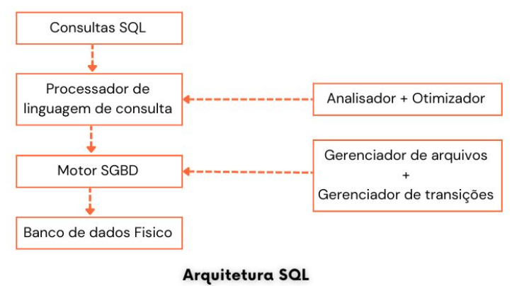

## <center> Introdução ao SQL </center>

Linguagem de consulta estruturada, abreviada como SQL, é uma linguagem específica de domínio usada em programação e projetada para gerenciar dados mantidos em um sistema de gerenciamento de banco de dados relacional ou para processamento de fluxo em um sistema de gerenciamento de fluxo de dados relacional.<br>
SQL é uma linguagem de Consulta Estruturada, que é uma linguagem de computador para armazenar e gerenciar dados em um banco de dados relacional.<br>

### Por que SQL?

- Permite que os usuários acessem dados nos sistemas de gerenciamento de banco de dados relacional.
- Permite que os usuários descrevam os dados.
- Permite que os usuários definam os dados num banco de dados e manipulem esses dados.
-  Permite incorporar em outras linguagens módulos usando SQL, bibliotecas e pré-compiladores.
- Permite que os usuários criem e eliminem bancos de dados e tabelas.
-Permite que os usuários criem visão, procedimento aramazenado, funções num banco de dados.
- Permite que os usuários definam permissões em tabelas, procedimentos e visualizações.

### Processo SQL
Quando executamos um comando SQL para qualquer RDBMS, o sistema determina a maneira de realizar a sua solicitação e o macanismo SQL descobre como interpretar a tarefa. Existem vários componentes incluídos nesse processo.<br>

- Despachante de consultas
- Mecanismos de otimização 
- Mecanismo de consulta clássico
- Mecanismo de consulta SQL, etc.




### Linguagem de definição de dados
Linguagem de definição de dados (ou DDL, de Data Definition Language) é um conjunto de comandos dentro do SQL usada para a definição das estruturadas de dados, fornecendo as instruções que permitem a criação, modificação e remoção das tabelas, assim como criação de índices.<br>
Uma vez complados, os parâmetros DDL são armazenados num conjunto de arquivos denominado dicionário de dados (ou catálogo). O dicionário de dados contém os **metadados** (dados a respeito das estruturas de armazenamento). O SGBD sempre consulta os metadados a cada operação sobre o banco de dados.<br>
Instruções SQL permitem definir a estrutura de uma base de dados, incluindo as linhas, colunas, tabelas, índices e outros metadados.<br>
DDL instruções SQL são mais parte do SGBD e têm grandes diferenças entre as variações SQL. DDL comandos SQL tem o seguinte:

- ### CREATE:
Uma declaração CREATE permite a criação de uma nova base de dados, tabela, índice ou consulta armazenada, sendo os tipos de objetos que podem ser criados definidos pelo SGBD que está sendo utilizado. Entre os principais comandos inclusos estão o CREATE DATABASE (criar banco de dados), CREATE TABLE (criar tabela) e outros. <br>

> Exemplo: crie um banco de dados com nome registro_de_alunos:<br>

```
CREATE DATABASE registro_de_alunos;
```

Agora crie uma tabea alunos para esse BD com as seguintes colunas: nome, matricula e curso.

``` 
registro_de_alunos;

CREATE TABLE alunos (

nome CHAR(50) NOT NULL, 
matricula INT NOT NULL,
curso CHAR(50) NOT NULL, 
PRIMARY KEY(matricula)

);
```
- ### DROP:
DROP permite remover uma base de dados existente, tabela, índice, ou view, sendo os tipos de objetos que podem ser removidos definidos pelo SGBD que está sendo utilizado. Entre os principais comandos inclusos estão DROP DATABASE = apaga o banco de dados por inteiro, DROP TABLE = apaga tabela.<br>

- ### ALTER:
ALTER permite alterar um objeto de um banco de dados, sendo os tipos de objetos que podem ser alterados definidos pelo SGBD que está sendo utilizado. Entre os principais comandos estão: ALTER TABLE ADD = adicionar uma coluna na tabela, ALTER TABLE DROP = excluir coluna na tabela.<br>

